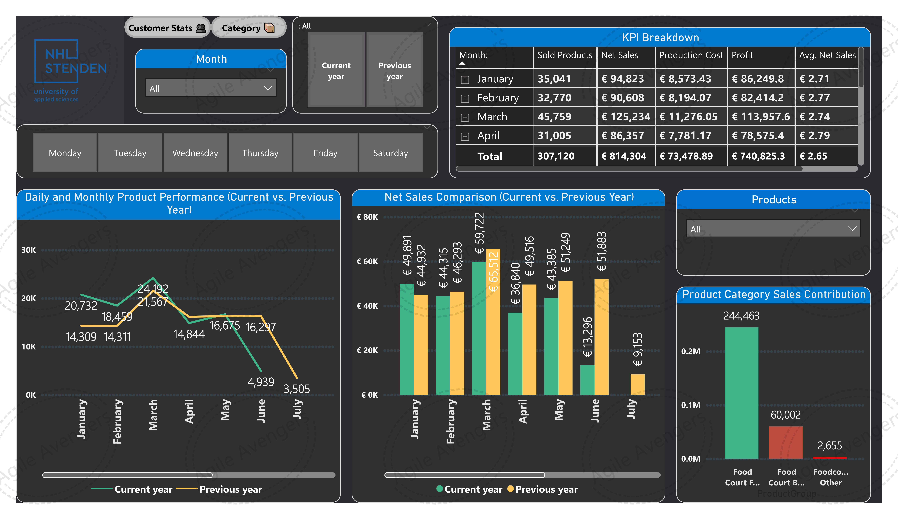
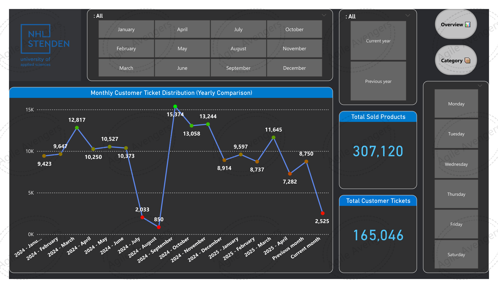
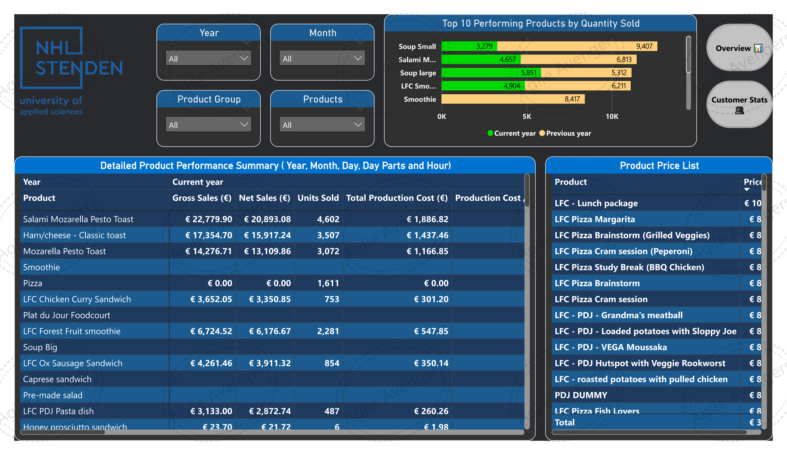

# Product Performance Dashboard

## Project Overview

This project was developed as part of a university module at NHL Stenden University of Applied Sciences.

The objective was to analyse sales, customer behaviour, and product performance using interactive dashboards.

Because the dataset was hosted on a shared cloud environment and updated concurrently by multiple students, the original dataset is unavailable. However, the dashboard screenshots and methodology demonstrate the analytical approach used.

---

## Business Problem

Management wanted to understand:

- Which products perform best.
- Sales trends over time.
- Customer ticket distribution.
- Product category contribution.
- Performance comparison between current and previous periods.

---

## Tools Used

- Power BI
- Power Query
- DAX
- Excel
- Cloud-hosted dataset

---

## Key Features

- Interactive slicers
- Year-over-year comparisons
- KPI tracking
- Product contribution analysis
- Customer trend analysis

---

## Dashboard Screenshots

### Overview Dashboard

### Customer Statistics Dashboard

### Product Dashboard

